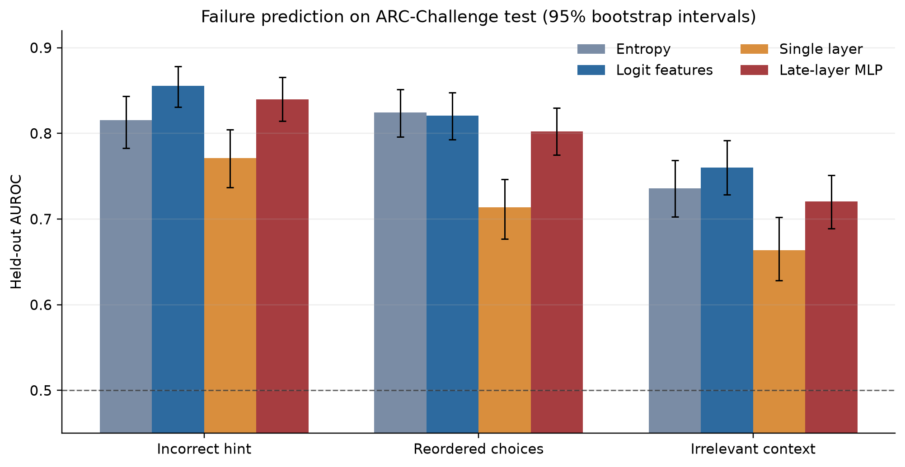

# Predicting LLM Failures from Internal Activations

Can an LLM's clean-prompt internal activations predict whether its answer will change under a
controlled prompt perturbation, beyond what its output confidence already reveals?

This repository starts with a local-first ARC pilot for `Qwen/Qwen3-0.6B`. It scores the next-token
logits for `A/B/C/D`, disables Qwen thinking mode, creates three paired perturbations, and caches
only the clean prompt's final-position residual stream after every transformer block.

## Pilot design

The default pilot samples 200 four-choice questions from ARC-Challenge's training split with a
fixed seed. It keeps the official validation split available for selecting hint strength later.
For each question it evaluates:

1. the clean prompt;
2. an incorrect answer hint;
3. deterministically reordered choices; and
4. an irrelevant question sentence.

Reordered answers are mapped back to their original semantic choice before flip rates are
computed. The output schema is documented in [`docs/data-schema.md`](docs/data-schema.md).

## Local setup

Python 3.12 is recommended. On Apple Silicon, the defaults select MPS and bfloat16. Qwen's
float16 forward pass can produce non-finite logits on MPS, while bfloat16 matches its native
weights and is stable on M3 hardware.

```bash
python3.12 -m venv .venv
source .venv/bin/activate
python -m pip install --upgrade pip
python -m pip install -r requirements-lock.txt
pytest
```

Run a two-question end-to-end smoke test before the full pilot:

```bash
llm-failures pilot --config configs/pilot_arc.yaml --limit 2 --run-id smoke
```

Then run the configured 200-question pilot:

```bash
llm-failures pilot --config configs/pilot_arc.yaml
```

Compare the bare-letter scoring prompt with an explicit answer cue on both development and final
model sizes. This gate uses 100 ARC validation questions and does not touch the test split:

```bash
llm-failures model-gate --config configs/prompt_model_gate.yaml
```

After extracting the frozen ARC train and validation configurations, fit calibrated confidence
baselines and one logistic-regression probe per transformer layer:

```bash
llm-failures probe --config configs/probes_arc_validation.yaml
```

The probe command reports AUROC, AUPRC, Brier score, expected calibration error, bootstrap
intervals for the main comparisons, and metrics on the originally-correct subset. It saves the
fitted confidence models and validation-selected layer probe for held-out evaluation. Paired
bootstrap intervals directly compare the selected activation probe against the combined
logit-feature baseline on the same questions. A separate 1:1 nearest-neighbor diagnostic compares
discrimination after matching flipped and non-flipped examples on clean top-two logit margin.

Train the planned small PyTorch MLP over the top three validation-selected activation layers:

```bash
llm-failures mlp --config configs/mlp_arc_validation.yaml
```

The MLP uses train-only feature standardization, dropout, weight decay, and validation-loss early
stopping. It saves the selected layers, normalization statistics, and best model checkpoint for a
single frozen evaluation on ARC test.

After all model and layer choices are frozen, evaluate the saved artifacts once on ARC test without
refitting or reselection:

```bash
llm-failures heldout --config configs/heldout_arc_test.yaml
```

Artifacts are excluded from Git and written below `artifacts/pilot_arc/`. A run manifest records
the resolved Hugging Face commit, package versions, answer token IDs, device, activation shape,
and elapsed time. The default config also pins the model and ARC dataset repository commits.

The completed Week 1 run and its main caveat are recorded in
[`reports/week1-pilot.md`](reports/week1-pilot.md). The 0.6B model has a strong answer-position bias,
so prompt-format and 1.7B comparisons were required before scaling the dataset. The completed
[`prompt/model gate`](reports/prompt-model-gate.md) selected Qwen3-1.7B with the bare-letter prompt;
pinned train, validation, and test extraction configs are under `configs/extraction/`.

The first [`ARC validation probe report`](reports/arc-validation-probes.md) is a negative result:
single-layer activation probes predict flips above chance but underperform combined logit features
for all three perturbations. At that stage, the ARC test split remained untouched while the
late-layer MLP and no-refit evaluator were frozen.

The frozen [`held-out ARC report`](reports/arc-heldout-results.md) finds that the late-layer MLP
nearly matches, but does not beat, combined logit features on the natural test distribution. A
predeclared margin-matched diagnostic finds a narrower positive result for choice reordering.



Machine-readable summaries for the prompt gate, validation probes, validation MLP, and held-out
evaluation are tracked under [`reports/results/`](reports/results/).

The out-of-domain configuration evaluates the frozen ARC-trained models on a pinned 500-question
sample from MMLU without retraining:

```bash
llm-failures pilot --config configs/extraction/mmlu_test_qwen3_1.7b.yaml
llm-failures heldout --config configs/ood_mmlu.yaml
```

## Scope and leakage rules

- The unit of splitting is always the original `question_id`; paired variants must never cross
  splits.
- Only clean-run activations are probe features. Perturbed runs supply outcome labels.
- Entropy is computed over the normalized four-answer distribution, and margin is the difference
  between the largest two answer logits.
- Perturbation strength must be selected using validation data, never the held-out evaluation set.
- Activation patching is a later follow-up and requires unrelated-activation and norm-matched-noise
  controls before any causal claim.

## Roadmap

- Week 1: evaluator, schema, activation cache, and 200-question ARC pilot.
- Week 2: scale paired data and measure label balance across hint strengths.
- Week 3: confidence baselines and one logistic-regression probe per layer.
- Week 4: grouped evaluation, calibration, bootstrap intervals, and MMLU transfer.
- Week 5: final-position activation patching with negative controls.
- Week 6: final runs, plots, tests, README, and short report.
