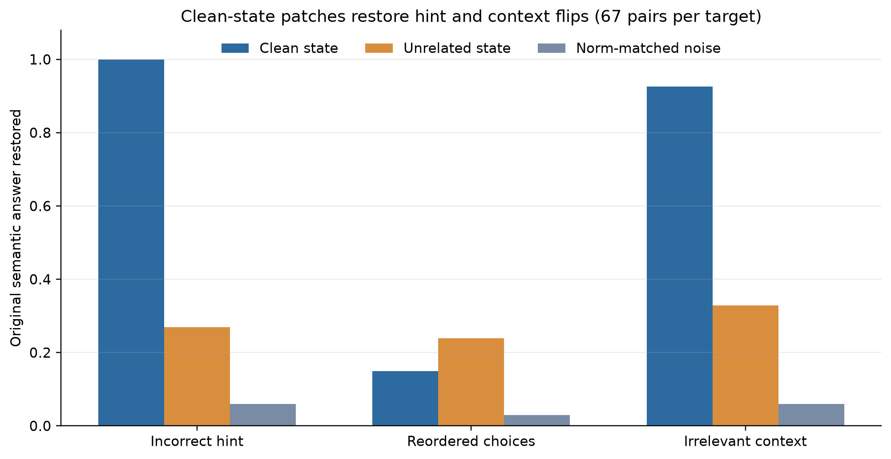

# Controlled activation patching

## Design

The frozen causal follow-up sampled 67 answer-flipping ARC test pairs for each perturbation (201
total). At one validation-selected final-position state per target, the perturbed replay received:

- the corresponding state from the same question's clean prompt;
- a clean state from an unrelated question;
- a random displacement from the perturbed state with the same norm as the clean displacement; or
- its own perturbed state as an identity sanity check.

Cached indices 26, 27, and 22 were used for hints, reordered choices, and irrelevant context.
Index 27 is Qwen3's terminal normalized state; the others are post-block residual states. All 201
replays reproduced the recorded answer logits exactly, and every identity patch had zero maximum
answer-logit difference. Comparisons use 1,000 paired bootstrap samples.

## Results

| Failure target | Clean patch | Unrelated state | Norm-matched noise | Clean − unrelated (95% CI) | Clean − noise (95% CI) |
|---|---:|---:|---:|---:|---:|
| Incorrect hint | 67/67 (1.000) | 18/67 (0.269) | 4/67 (0.060) | +0.731 [+0.612, +0.836] | +0.940 [+0.881, +0.985] |
| Reordered choices | 10/67 (0.149) | 16/67 (0.239) | 2/67 (0.030) | −0.090 [−0.239, +0.060] | +0.119 [+0.030, +0.224] |
| Irrelevant context | 62/67 (0.925) | 22/67 (0.328) | 4/67 (0.060) | +0.597 [+0.463, +0.717] | +0.866 [+0.791, +0.940] |

The same pattern appears in the clean-answer logit margin. Clean patches increase the margin by
14.16 logits for hints and 18.47 for irrelevant context. Their paired advantages are +16.99
[+12.05, +21.45] and +18.70 [+14.20, +23.11] over unrelated-state patches, and +13.51
[+11.69, +15.46] and +18.13 [+15.78, +20.46] over norm-matched noise. All four intervals exclude
zero.

For reordering, the clean patch changes the semantic-answer margin by −0.42 logits. It has no
detectable margin advantage over either control: +0.09 [−4.10, +4.16] versus an unrelated state and
−0.68 [−3.84, +2.31] versus norm-matched noise.

## Reordering coordinate diagnostic

A terminal hidden state drives a displayed answer letter through the fixed language-model head. In
10 of the 67 sampled reorder pairs, the clean semantic choice remained under the same displayed
letter; the clean terminal-state patch restored all 10. In the other 57 pairs, that choice moved to
a different letter; the patch restored none. Thus the 10/67 result reflects output-letter
coordinates rather than semantic answer restoration.

One post-hoc sensitivity used the exact same 67 examples and controls but patched cached index 26,
the nearest preterminal residual state, so the final transformer block could in principle recompute
the displayed letter. It again restored 10/67, versus 20/67 for unrelated states and 2/67 for
norm-matched noise. Its clean-answer margin effect was −0.41, with no advantage over either control.
No further layer search was performed.

## Interpretation

These interventions provide controlled evidence that the selected late clean states causally
influence answer recovery for incorrect hints and irrelevant context: the effect is large, paired
within question, and clearly exceeds both negative controls. The result is localized to this model,
prompt format, intervention site, and flipped-example sample. It does not show that activation
probes outperform output confidence—the predictive study found the opposite—and it does not by
itself identify a general failure mechanism.

Choice reordering is a careful negative result. Neither the validation-selected terminal state nor
the one-step-earlier residual state restores the remapped semantic choice beyond an unrelated-state
control. Earlier-layer interventions could answer a different mechanistic question, but scanning
for a favorable layer after seeing these outcomes would require a new preregistered experiment.
