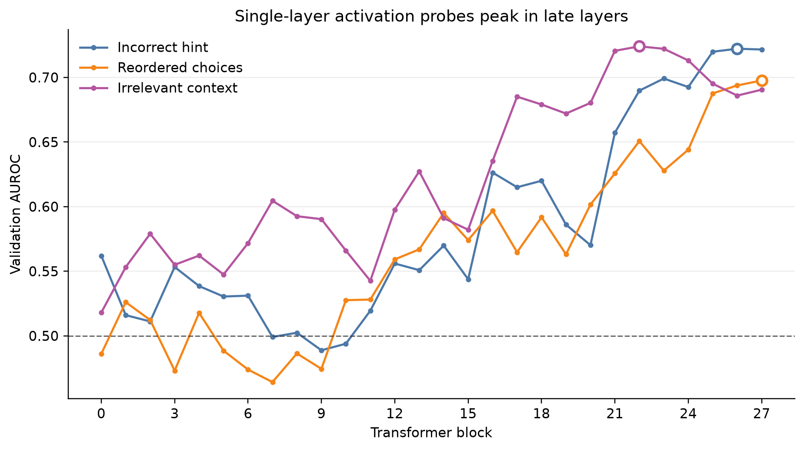
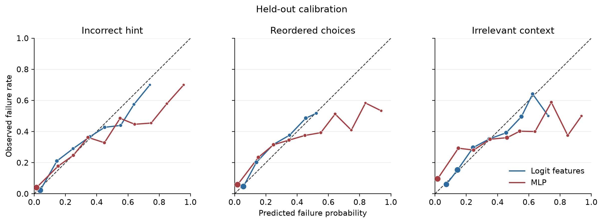

# Held-out ARC results

## Frozen evaluation

The model, prompt, perturbations, single-layer choices, MLP layers, and evaluation code were frozen
in commit `a155f84` before inspecting ARC-Challenge test results. Fitted weights and normalization
statistics were saved before test extraction in immutable local run directories. The evaluator
performed no fitting or selection. It evaluated 1,165 usable four-choice test questions, including
197 incorrect-hint failures, 219 choice-reordering failures, and 285 irrelevant-context failures.

## Main results

| Failure target | Entropy AUROC | Logit AUROC | Single layer | Late-layer MLP | MLP − logit (95% CI) |
|---|---:|---:|---:|---:|---:|
| Incorrect hint | 0.816 | 0.856 | 0.771 | 0.840 | −0.016 [−0.039, 0.005] |
| Reordered choices | 0.824 | 0.821 | 0.714 | 0.802 | −0.018 [−0.040, 0.005] |
| Irrelevant context | 0.736 | 0.760 | 0.663 | 0.721 | −0.039 [−0.067, −0.009] |

| Failure target | Logit AUPRC | MLP AUPRC | Difference (95% CI) | Logit Brier | MLP Brier |
|---|---:|---:|---:|---:|---:|
| Incorrect hint | 0.491 | 0.469 | −0.022 [−0.089, 0.039] | 0.107 | 0.116 |
| Reordered choices | 0.455 | 0.417 | −0.038 [−0.099, 0.027] | 0.122 | 0.136 |
| Irrelevant context | 0.490 | 0.406 | −0.084 [−0.142, −0.023] | 0.157 | 0.182 |

The MLP is statistically tied with the combined logit-feature model in AUROC for incorrect hints
and reordered choices, but it does not outperform it. It is significantly worse for irrelevant
context. Its Brier score is worse for all three targets; the paired interval excludes zero in every
case. Single-layer probes underperform the logit model by a larger and statistically clear margin.

## Originally-correct questions

There were 866 originally-correct test questions. MLP versus logit AUROC was 0.876 versus 0.892 for
hints, 0.840 versus 0.835 for reordering, and 0.736 versus 0.772 for irrelevant context. The small
reordering advantage was not used for model selection and is not a full-sample improvement.

## Margin-matched diagnostic

Failures were matched 1:1 without replacement to non-failures with the nearest clean top-two logit
margin. Absolute standardized margin differences were at most 0.030.

| Failure target | Matched pairs | Logit AUROC | MLP AUROC | Difference (95% CI) |
|---|---:|---:|---:|---:|
| Incorrect hint | 197 | 0.575 | 0.625 | +0.050 [−0.007, 0.105] |
| Reordered choices | 219 | 0.505 | 0.566 | **+0.061 [0.003, 0.113]** |
| Irrelevant context | 285 | 0.550 | 0.563 | +0.014 [−0.032, 0.063] |

This predeclared diagnostic provides limited evidence of activation information conditional on
output margin for choice reordering. It does not overturn the main result: across the natural test
distribution, internal activations do not improve discrimination or calibration beyond the answer
logits.

## Conclusion

The project answers its central question with a qualified negative result. Clean activations
predict controlled answer changes substantially above chance, and a regularized multi-layer MLP
nearly matches confidence-based discrimination for two perturbations. However, output-logit
features remain as good or better on full held-out ARC, especially for calibration. The
margin-matched reordering result is a narrow positive follow-up worth testing out of domain, not a
basis for a broad causal or safety claim.

Machine-readable validation and held-out outputs are stored in `reports/results/`.
