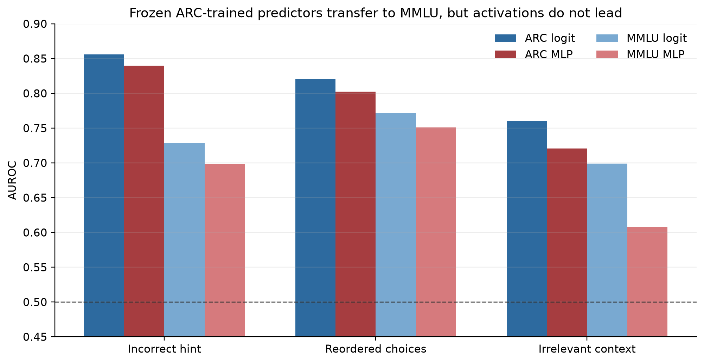

# MMLU out-of-domain transfer

## Setup

The ARC-trained confidence models, single-layer probes, and late-layer MLP checkpoints were applied
without retraining to a deterministic 500-question sample from the subject-mixed MMLU test split.
The MMLU dataset revision, Qwen3-1.7B revision, sample seed, prompt, and perturbations were pinned
before extraction. Clean answer accuracy was 57.0%.

The sample contained 106 incorrect-hint failures, 192 choice-reordering failures, and 148
irrelevant-context failures.

## Transfer results

| Failure target | Entropy AUROC | Logit AUROC | Single layer | Late-layer MLP | MLP − logit (95% CI) |
|---|---:|---:|---:|---:|---:|
| Incorrect hint | 0.746 | 0.728 | 0.649 | 0.698 | −0.030 [−0.089, 0.028] |
| Reordered choices | 0.780 | 0.772 | 0.655 | 0.751 | −0.022 [−0.057, 0.018] |
| Irrelevant context | 0.678 | 0.699 | 0.592 | 0.608 | −0.091 [−0.151, −0.027] |

| Failure target | Logit AUPRC | MLP AUPRC | Difference (95% CI) | Logit Brier | MLP Brier |
|---|---:|---:|---:|---:|---:|
| Incorrect hint | 0.382 | 0.356 | −0.026 [−0.108, 0.067] | 0.155 | 0.202 |
| Reordered choices | 0.631 | 0.612 | −0.019 [−0.089, 0.056] | 0.203 | 0.209 |
| Irrelevant context | 0.498 | 0.365 | −0.133 [−0.213, −0.051] | 0.193 | 0.243 |

The MLP transfers above chance for all three targets and remains close to the logit model for hints
and reordering. It does not outperform output features, and its probability calibration degrades
more severely across datasets. The irrelevant-context probe has the clearest transfer failure.

## Margin-matched diagnostic

Matching achieves absolute standardized margin differences of 0.008 for hints and 0.028 for
irrelevant context. MLP-minus-logit AUROC differences are +0.053 [−0.035, 0.145] and +0.005
[−0.082, 0.088], respectively. Neither is distinguishable from zero.

The reordering match has a standardized margin difference of −0.546, indicating inadequate common
support; its matched comparison is therefore not interpreted.

## Conclusion

The qualified negative ARC result transfers out of domain. Internal activations carry failure
signal, but the frozen activation models do not add reliable predictive value beyond output
confidence on MMLU. The ARC margin-matched reordering result does not replicate under a balanced
MMLU comparison because adequate margin matching was not achieved for that target.

